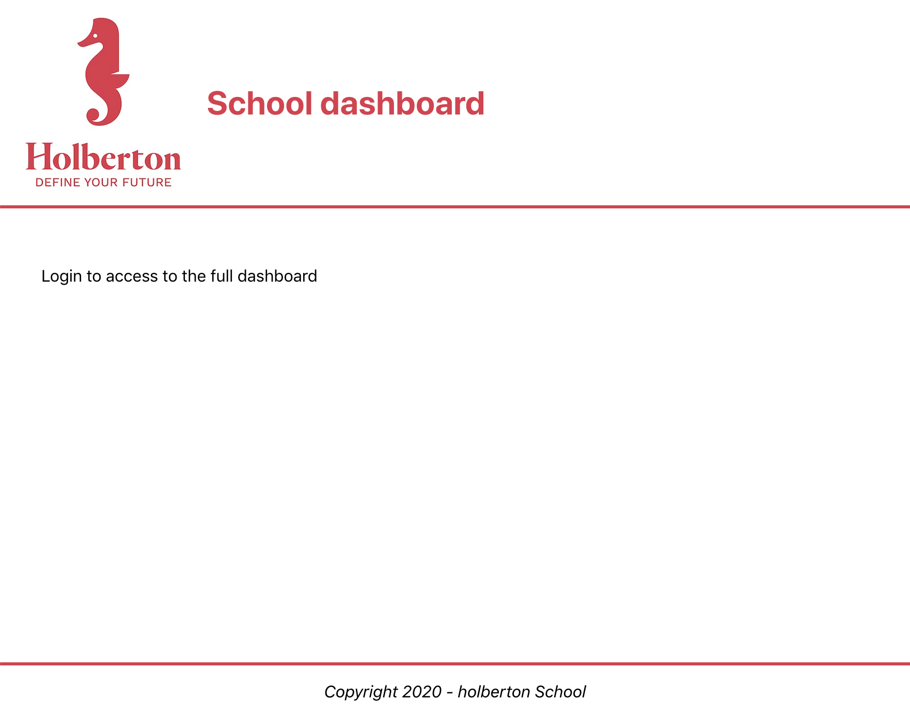

# react_intro
In this project, we learned how to create an application using React.

Topics Covered:
- How to create a basic Javascript application using React
- How to use the package `create-react-app` to start developing quickly with React
- What JSX is and how to use it
- How to use the React Developer Tools to debug your code
- How to use Enzyme’s Shadow rendering to test your application
- How to use React with Webpack & Babel

Table of Contents:
- [0. Basic application](#0-basic-application)

## 0. Basic application

**Create a basic app named `dashboard` using `create-react-app` in your `task_0` directory**

**Remove the unused files:**

- `reportWebVitals.js`
- `index.css`
- `App.test.js`

**in `task_0/dashboard/src/App.js`, create a function `App` that returns:**

- a header div with a class named `App-header` containing the Holberton logo and a h1 with the text `School dashboard`
- a body div with a class named `App-body` containing at least one paragraph with the text `Login to access the full dashboard`
- a footer div with a class named `App-footer` containing at least one paragraph with the text `Copyright 2024 - holberton School`

**Modify the App.css to make the project looks like the following screenshot:**

**Requirements:**

- When running, there should not be any lint error in the console
- Given Files: `task_0/dashboard/src/favicon.ico, task_0/dashboard/src/logo.jpg`
- File: `task_0/dashboard/src/, task_0/dashboard/src/App.css, task_0/dashboard/src/App.js`
